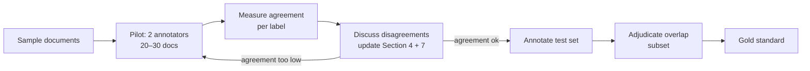
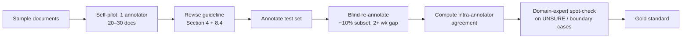

# NER Annotation Guidelines – Art & Architecture History (German)

Sep 23, 2026 · @Someone

## 1. Purpose and scope

These guidelines define how human annotators mark seven entity types — and, from v0.4, the relationships between them — in German art- and architecture-historical texts. The resulting gold standard is used to evaluate an LLM-based NER + relation-extraction pipeline (DeepSeek-Chat / DeepSeek-V3, via the hosted DeepSeek API, temperature = 0.0) whose prompt uses the same CIDOC-CRM-informed definitions. See Section 8 for the relationship vocabulary.

The seven entity types are:

| Label | Entity type | CIDOC-CRM basis | Pipeline JSON key |
| --- | --- | --- | --- |
| PER | Person | E21 Person | `persons` |
| PLACE | Place | E53 Place | `places` |
| DATE | Date / time expression | E52 Time-Span (expressed through E49 Time Appellation) | `dates` |
| OBJ | Physical human-made thing | E24 Physical Human-Made Thing (incl. E22 Human-Made Object) | `physical_human_made_thing` |
| VIS | Visual item | E36 Visual Item | `visual_item` |
| ICO | Iconographic subject | What a visual item depicts or represents (P62 depicts / P138 represents), typically a type or theme (E55 Type) | `iconographic_subject` |
| GRO | Group | E74 Group | `groups` |

The JSON key column is what the pipeline's `extract_entities_llm` output actually calls each category — needed to align the scoring script against the pipeline's raw output rather than against the human-readable label codes above.

How to use these guidelines:

- Annotate what the **text says**, not what you know. If the text does not make an entity explicit, do not add it from background knowledge.
- Annotate **every mention**, including repeated ones. Pronouns ("er", "es", "dieses") are never annotated.
- When a case is not covered, mark it with the flag `UNSURE` in the tool, make your best choice, and bring it to the adjudication meeting. New decisions are added to Section 4 and logged in Section 7.
- Do not look at the model's output before or during annotation.

## 2. General annotation principles

Two kinds of mentions are annotated. **PER and DATE** require a reference to a specific person or time. **PLACE, OBJ, VIS and ICO** also cover unnamed, type-level terms as they occur in inventory texts: \[Kanzel\], \[Chor\], \[Laubwerk\], \[Kreuzigung\]. Every occurrence is annotated.

**Span boundaries**

- Mark the **shortest span that fully names the entity**. Include all name parts, titles that are part of the name, and ordinals: \[Abt Heinrich III.\], \[Maler Michael\], \[Joh. Chr. Kunkler\].
- **Exclude articles and prepositions**: im \[Chor\], von \[Johannes Murer\], der \[Hochaltar\].
- **Include inflection** as it appears; do not normalise: \[Grubenmanns\] Pläne, des \[Münsters\], mit \[Hochbarockornamenten\].
- **Type-level terms**: mark the term itself, without descriptive adjectives: spätgotischer \[Flügelaufsatz\], reiches \[Laubwerk\], vergoldete \[Kanzel\]. Keep adjectives that are part of a fixed term: \[Laufender Hund\], \[Heilige Familie\].
- **Compounds**: annotate the whole compound: \[Sebastianaltar\], \[Fischblasenmaßwerk\], \[Heiligenbrustbildern\]. Do not split a compound into parts.
- **Attached phrases**: a genitive or prepositional phrase that adds another entity is annotated separately: \[Hochaltar\] der \[Stiftskirche\]; \[Figur\] der \[hl. Barbara\].
- **Coordination**: annotate each conjunct separately when each is a full term: \[Kanzel\] und \[Taufstein\]. Keep fixed subject phrases together: \[Josef und Maria mit Kind\].
- **Quoted titles**: exclude the quotation marks, include the full title.

**What is never annotated**

- Pronouns ("er", "es", "dieser").
- Generic nouns outside the four type-level categories: "der Künstler", "das Werk", "der Bau" (as an abstract reference).
- Inventory numbers, shelf marks, page references, and measurements. Archive names inside citations *are* annotated (PLACE): \[StA\] St. Gallen – see Section 7.

## 3. Category definitions

The definitions below are the same ones used in the model's prompt, so annotators and model apply identical concepts. Example lists are illustrative, not exhaustive: annotate any term that fits the definition.

### PER – Person (E21)

Real persons who live or are assumed to have lived. Legendary figures who may have existed (e.g. Ulysses, King Arthur) are PER only if the text refers to them as historical figures. If it is unclear whether two names refer to the same person, annotate each mention as it stands.

All named individuals, including:

- **Architects and master builders** (Werkmeister, Baumeister, Oberbaumeister): \[Johannes Murer\], \[Michel von Saroy\], \[Johannes Grubenmann\], \[Hans Ulrich Grubenmann\], \[Joh. Georg Müller\], \[Joh. Chr. Kunkler\], \[Ferdinand Stadler\], \[Magnus Hetzer\], \[Linhart Ränftler\]
- **Painters, sculptors, woodcarvers**: \[Michael Lang\] (\[Maler Michael\]), \[Joseph Anton Feuchtmayer\], \[Joh. Georg Dirr\], \[Karl Ulrich Rheiner\]
- **Patrons, clergy, city officials, donors**: \[Abt Heinrich III.\], \[Otmar Bomer\], \[Johannes Wyss\]
- **Art historians and cited authors**: \[Wegelin\], \[Vadian\], \[Keßler\], \[Rütiner\], \[H. Rott\]
- **Bell casters, craftsmen**: \[Ulrich Schnabelburg\], \[Karl Rosenlächer\], \[Schalch\]

Abbreviated names ("Joh.", "J. C.", "H.") are annotated as PER wherever they refer to a person.

Not PER: saints, biblical, mythological and allegorical figures in depictions (→ ICO, see 4.3); workshops and institutions.

### GRO – Group (E74)

Any gatherings or organisations of human individuals that act collectively due to some unifying relationship: workshops/Werkstätten, guilds, chapters (Chorherrenstift, Domkapitel), religious orders/communities (as a body of people, not their building), city councils, church councils, parish communities, families, married couples, and nationalities.

Do **not** default an ambiguous institution or uncertain entity to GRO just because no other category seems to fit — check PLACE and OBJ first.

**Like ICO, GRO entities are often generic role/body phrases, not unique proper names — annotate them even without one**: \[die Kirchgemeinde\], \[der Stiftungsrat\], \[die Erben von X\], \[die Mönche von Salem\], \[das Domkapitel\] all count as GRO.

**Contrast**: \[Kloster Salem\] as the physical monastery building/complex being located-in or built → PLACE (the whole name is one PLACE span, per Section 4.6); the community of monks acting collectively ("das Kloster beschloss...", "die Mönche von Salem") → GRO. A single named craftsman → PER, not GRO. "Werkstatt Feuchtmayer" as the collective workshop (not the one named person) → GRO.

### PLACE – Place (E53)

Extents in natural space, in particular on the Earth's surface, independent of time and matter. Places describe where things or events are located. They are usually determined by reference to immobile objects (buildings, cities, mountains, rivers), may have fuzzy boundaries, and can be defined relative to a physical thing, such as a room within a church.

All named locations, including:

- **Cities and towns**: \[St. Gallen\], \[Konstanz\], \[Salem\], \[Überlingen\], \[Ravensburg\], \[Bischofszell\], \[Wien\], \[Zürich\], \[Lindau\], \[Teufen\], \[Rorschach\], \[Mosnang\], \[Landsberg\], \[Florenz\], \[Schaffhausen\]
- **Churches and religious buildings** (as locations): \[St. Laurenzen\], \[St. Mangen\], \[Münster\], \[Stiftskirche\], \[Kloster Salem\]
- **Spaces within buildings**: \[Sakristei\], \[Chor\], \[Langhaus\], \[Empore\], \[Kapelle\], \[Turm\]
- **Archives and museums**: \[Historisches Museum\], \[Stiftsarchiv\] (\[StA\]), \[Stiftsbibliothek\]

A building or space is PLACE only when it locates something else; as a product of human activity it is OBJ (see 4.2).

Not PLACE: nationality adjectives and style labels ("Konstanzer Werkstatt", "Bodensee-Gotik").

### OBJ – Physical human-made thing (E24 / E22)

Discrete, identifiable human-made items documented as single units and characterised by relative stability. A building is OBJ when it is cited not as a place but as the product of human activity. OBJ covers artworks, everyday utensils, textiles, and architectural elements, for example:

- **Altars**: \[Hochaltar\], \[Seitenaltar\], \[Marienaltar\], \[Sebastianaltar\], \[Jakobsaltar\], \[Annaaltar\], \[Mauritiusaltar\]
- **Furnishings**: \[Kanzel\], \[Orgel\], \[Taufstein\], \[Gestühl\], \[Empore\]
- **Artworks**: \[Glasgemälde\], \[Flügelaufsatz\], \[Skulpturen\], \[Figuren\], \[Kreuzigungsgruppe\], \[Reliquiare\]
- **Architectural elements**: \[Arkaden\], \[Pfeiler\], \[Fenster\], \[Maßwerk\], \[Turm\], \[Portal\], \[Gewölbe\], \[Glocke\]
- **Documents**: \[Jahrzeitbuch\], \[Ablaßbrief\], \[Urkunde\]

Some terms also appear under PLACE (Empore, Turm) or VIS (Maßwerk). Section 4.7 decides between them.

### VIS – Visual item (E36)

The intellectual or conceptual aspect of recognisable marks, images and other visual works: the underlying prototype, not an individual physical embodiment. A logo stays the same logo on any number of publications, even if size, orientation and colour change; the same holds for images reproduced many times. Visual items are therefore independent of their physical support. VIS links physical things that carry the same visual qualities (symbols, marks, images).

In this project VIS also covers **decorative and ornamental forms**, for example:

- **Foliage and flowers**: \[Laubwerk\], \[Blattwerk\], \[Blattornament\], \[Ranken\], \[Rankenornament\], \[Blumen\], \[Blumengebinden\], \[Blumenzweigen\], \[Blumenfeldern\], \[Blumendekor in der Vase\], \[stilisierter Blumendekor in einem Topf\], \[Tulpenblüten\], \[Nelken\], \[Rose\], \[Rosetten\], \[Palmette\], \[Lebensbaum\]
- **Architectural ornament and profiles**: \[Maßwerk\], \[Fischblasen\], \[Wirbelrosetten\], \[Akanthuskonsolen\], \[Karniesprofilierung\], \[Kehlen\], \[Rundstäbe\], \[Schweifungen\], \[Kapitell\], \[Halbsäule\], \[Lisene\], \[Fries\], \[Bogenfries\], \[Ornamentbogen\]
- **Baroque and Rococo ornament**: \[Hochbarockornamenten\], \[Rocaille\], \[Rocaillerahmen\], \[Muschelwerk\], \[Bandelwerk\], \[Rollwerk\], \[Ohrmuschelornament\], \[Kartusche\], \[Lambrequin\], \[Volute\], \[Groteske\], \[Arabeske\], \[Chinoiserie\], \[Zirkelschlagornamentik\]
- **Surface and applied decoration**: \[Vergoldung\], \[Eisengitter\], \[Marmorierung\], \[Maserierung\], \[Intarsien\], \[Draperie\], \[Feston\], \[Girlande\], \[Medaillon\], \[Bordüre\], \[Laufender Hund\]
- **Inscriptions, monograms, signs**: \[Inschriften\], \[Sinnspruch\], \[Monogramme IHS\], \[Monogramm für Maria und Josef\], \[Jesussymbole\], \[Mariasymbole\], \[Herz Jesu\]
- **Decorative animal and fruit motifs**: \[Hirschen\], \[Pferd\], \[Vögel\], \[Früchteschalen\], \[Apfel\], \[Birne\], \[Ackerfrüchte\]

VIS also covers titles of specific images or compositions when the text refers to the image rather than its carrier (see 4.1).

### ICO – Iconographic subject

Depicted scenes, figures and allegories: what an image represents. An iconographic subject can include visual items (a scene built from motifs). For example:

**Unlike PER, most ICO entities are generic common-noun phrases, not proper names — do not skip a depicted figure or scene just because it isn't capitalized or unique.** A plural, unnamed depicted figure ("Engel" = angels, "Apostel" = apostles, "Putten" = cherubs, "Evangelistensymbole") appearing in a sculptural or painted description still counts as ICO — annotate the figure type itself (e.g. \[Engel\]) even without an individual name.

- **Biblical scenes and cycles**: \[Kreuzigung\], \[Christi Kreuzestod\], \[Verkündigung\], \[Verkündigung der Maria\], \[Himmelfahrt\], \[Couronnement de Marie\], \[Szene von Geburt\], \[Szene von Tod\], \[Bilder aus dem Neuen Testament\], \[Bilder des Guten Hirten\]
- **Holy figures and groups**: \[Vier Evangelisten\], \[Heilige Familie\], \[Josef und Maria mit Kind\], \[Heilige Barbara\], \[Heiligen Margareta\], \[Heiligen Ottilie\], \[Heiligenbrustbildern\], \[weibliche Heilige in einer Landschaft\]
- **Generic depicted figures (even unnamed/plural)**: \[Engel\], \[Putten\], \[Apostel\], \[Heilige\], \[Evangelistensymbole\], \[stark bewegte Engel\] auf den Segmentstücken
- **Allegories and symbols**: \[Allegorie\], \[Tugenden/Laster\], \[Darstellung der Jahreszeiten\], \[Darstellung der Winterjahreszeit\], \[Symbole für Christi Geburt\], \[Marterwerkzeugen der Kreuzigung\]
- **Landscape, architecture and everyday life**: \[Landschaftsbilder\], \[Häusern in Landschaft\], \[Gebäude am See\], \[Arkadenarchitektur\], \[Szenen aus dem Dorfleben\], \[Alpabfahrt\], \[Scheibenschiessen\], \[Fechten\], \[Reiten\], \[Jagen und Fischen\]

Span: the whole subject phrase is one span, even if it contains a figure or motif: \[Josef und Maria mit Kind\], \[weibliche Heilige in einer Landschaft\].

### DATE – Date / time expression (E52, E49)

All temporal references; annotate exhaustively.

- **Years**: \[1225\], \[1413\], \[1418\], \[1504\], \[1577\], \[1764\], \[1851\]
- **Ranges** (one span): \[1851–1853\], \[1730–1745\], \[zwischen 1512 und 1514\]
- **Centuries**: \[12. Jahrhundert\], \[14. Jahrhundert\], \[Ende 15. Jahrhundert\]
- **Qualifiers that change the meaning** are included: \[um 1500\], \[ca. 1520\], \[vor 1520\], \[nach 1530\]
- **Named events with dates** (one span): \[Stadtbrand von 1314\], \[Reformation 1526\]

Excluded: plain prepositions and articles (im \[14. Jahrhundert\]); style periods (Gotik, Barock); relative expressions without an anchor ("drei Jahre später"). Events without a date ("nach der Reformation") – see Section 7.

## 4. Decision rules for hard cases

These rules decide the cases where annotators are most likely to disagree. When the context is genuinely neutral, apply the **default** listed for each rule.

### 4.1 OBJ vs. VIS: the carrier or the image?

Ask: *Could this statement also be true of a copy, a print impression, or a photograph of the work?*

- **Yes → VIS.** "Die \[Melencolia I\] zeigt eine geflügelte Figur" (true of every impression).
- **No → OBJ.** "Die \[Melencolia I\] im Kupferstichkabinett ist auf Papier mit Wasserzeichen gedruckt" (true of this sheet only).

| Cue in the text | Label |
| --- | --- |
| material, technique, dimensions, condition, restoration, provenance, location, purchase, theft | OBJ |
| composition, motif, iconography, style, meaning, copies after, versions, reception | VIS |
| creation ("malte", "schuf") | OBJ for unique works (painting, sculpture); VIS for multiples (prints) |

- **Default when neutral** ("Dürers \[Selbstbildnis im Pelzrock\]", just named): **VIS** – *confirm in Section 7*.
- The same title can receive different labels in the same text. Label each mention by its own context.

### 4.2 Buildings: PLACE or OBJ?

This rule applies to whole buildings (Münster, St. Laurenzen, Stiftskirche) and to spaces within them (Chor, Langhaus, Empore, Turm, Kapelle).

- **OBJ** when the building or space is treated as a made thing: construction, architect, style, parts, damage, restoration. "Das \[Münster\] wurde 1755–1766 neu errichtet." "Der \[Turm\] erhielt 1851 einen neuen Helm."
- **PLACE** when it only locates something else: "Im \[Chor\] steht das \[Gestühl\]." "Auf der \[Empore\] befindet sich die \[Orgel\]."
- **Default when neutral**: **OBJ**, because architecture is a core subject of the corpus – *confirm in Section 7*.

### 4.3 Persons vs. iconographic figures

- Biblical, mythological, legendary, and allegorical figures are always **ICO**, even though some were historical persons: \[Maria\], \[Petrus\], \[Herkules\], \[Justitia\].
- Saints are **ICO** when depicted or discussed as image subjects ("der heilige \[Hieronymus\] im Gehäus"). They are **PER** only in historical, non-iconographic contexts ("\[Bernhard von Clairvaux\] predigte 1146 in Speyer") – *confirm in Section 7*.
- Historical persons in portraits stay **PER**: "Bildnis des \[Jakob Fugger\]".

### 4.4 Artwork titles that contain other entities

Titles often contain persons, places, or subjects: „Die Madonna des Kanzlers Rolin“, „Ansicht von Delft“, „Die Anbetung der Könige“.

- If the phrase is used **as the title** of a specific work → annotate the **whole title** as VIS or OBJ (by 4.1).
- If the phrase describes **what is shown**, not a specific work → ICO (for scenes) or the embedded type (for persons, places).
- Test: "Dürers \[Anbetung der Könige\] in den Uffizien" → title of a specific work → OBJ. "Das Thema der \[Anbetung der Könige\] war in Köln beliebt" → subject → ICO.
- Inner entities of a title are handled in Section 5.

### 4.5 Dates vs. periods

- Numeric or calendar-anchored expressions → **DATE**.
- Named events **with** a date → one DATE span: \[Stadtbrand von 1314\], \[Reformation 1526\].
- Style and epoch names (Gotik, Spätgotik, Barock) → **not annotated**.
- Mixed forms: "in der Spätgotik um 1480" → only \[um 1480\] is DATE.

### 4.6 Places inside names

- A place that is part of a name is **not** annotated separately: \[Kloster Salem\] (PLACE only), \[Michel von Saroy\] (PER only).
- A place in an attached phrase **is** annotated separately: \[Hochaltar\] der \[Stiftskirche\].
- Persons with a following office and place ("Abt Heinrich III., Bischof von Konstanz") – *see Section 7*.

### 4.7 Terms listed in two categories

The definitions deliberately list some terms under two types. Decide by what the sentence says about the term.

| Term | Types | Rule | Example |
| --- | --- | --- | --- |
| Empore, Turm | PLACE / OBJ | Rule 4.2: location → PLACE, made thing → OBJ | "Orgel auf der \[Empore\]" = PLACE; "die \[Empore\] wurde 1764 eingebaut" = OBJ |
| Maßwerk | OBJ / VIS | Physical element that is built, damaged, replaced → OBJ; ornamental form or pattern → VIS | "das \[Maßwerk\] wurde erneuert" = OBJ; "Fenster mit \[Fischblasenmaßwerk\]" = VIS |
| Kapitell, Halbsäule, Lisene | VIS (listed) / OBJ (structural) | As decorative form → VIS; as a load-bearing or counted member → OBJ | "\[Kapitelle\] mit \[Akanthus\]": OBJ + VIS – *confirm in Section 7* |
| Vergoldung, Eisengitter | VIS | VIS by default; OBJ only when a separate object is meant ("das \[Eisengitter\] vor dem Chor wurde 1780 geschmiedet") | – |
| Arkaden / Arkadenarchitektur | OBJ / ICO | Built arcades → OBJ; arcades depicted in an image → ICO | "\[Arkadenarchitektur\] im Hintergrund der Tafel" = ICO |

### 4.8 VIS or ICO: ornament or subject?

Ask: *Does the term name what an image represents (a story, a being, a concept), or a decorative form?*

- **Represents a scene, figure, allegory or theme → ICO**: \[Kreuzigung\], \[Heilige Barbara\], \[Tugenden/Laster\], \[Jagen und Fischen\].
- **Decorates, frames or fills a surface → VIS**: \[Ranken\], \[Rocaille\], \[Blumengebinden\], \[Hirschen\] in a frieze.
- **Animals and plants**: decorative motif → VIS ("\[Vögel\] in \[Ranken\]"); part of a depicted scene → inside the ICO span ("\[Szenen aus dem Dorfleben\]").
- **Religious signs**: monograms and emblematic signs → VIS (\[Monogramme IHS\], \[Herz Jesu\], \[Mariasymbole\]); symbols presented as the subject of a depiction → ICO (\[Symbole für Christi Geburt\], \[Marterwerkzeugen der Kreuzigung\]) – *confirm in Section 7*.
- If a VIS term stands inside an ICO subject phrase, the ICO span wins (Section 5).

## 5. Overlaps and nesting

The current scheme is **flat**: every token belongs to at most one entity span, and the **outermost** entity wins.

| Text | Flat annotation | Not annotated separately |
| --- | --- | --- |
| Kloster Salem | \[Kloster Salem\] = PLACE | Salem (PLACE) |
| Stadtbrand von 1314 | \[Stadtbrand von 1314\] = DATE | 1314 (DATE) |
| Josef und Maria mit Kind | \[Josef und Maria mit Kind\] = ICO | Maria (ICO) |
| Fischblasenmaßwerk | \[Fischblasenmaßwerk\] = VIS | Fischblasen (VIS) |
| Hochaltar der Stiftskirche | \[Hochaltar\] = OBJ, \[Stiftskirche\] = PLACE | – (adjacent, not nested) |
| Figur der hl. Barbara | \[Figur\] = OBJ, \[hl. Barbara\] = ICO | – (adjacent, not nested) |

Why flat: most standard NER metrics and tools (seqeval, BIO tagging) assume non-overlapping spans, and the LLM output must be scored the same way.

**Alternative – nested annotation.** Inner entities are annotated too (e.g. \[Die Madonna des Kanzlers \[Rolin\]PER\]VIS). This captures richer information and suits a knowledge-graph use case, but annotation takes longer, agreement is usually lower, and evaluation needs a nested-aware scorer. If chosen, the prompt must also ask the model for nested entities – *decide in Section 7*.

## 6. Annotation workflow

This project currently runs with a **single annotator** (Section 7, open decision #17), but these guidelines are written to stay valid if a second annotator joins later, or for a future project that reuses them with more annotator capacity. Both variants share the same sampling and tooling steps (6.1, steps 1–2) and differ only in how the pilot, reliability check, and adjudication are carried out. Use 6.1 when two or more annotators are available; use 6.2 otherwise. Whichever variant is used, state which one in the paper's methods section — a reader should not have to guess whether "agreement" means inter- or intra-annotator agreement.

### 6.1 Two-annotator variant (ideal)

The workflow runs in four rounds: pilot, guideline revision, full annotation, adjudication.

1. **Sampling.** Draw documents randomly from the target corpus. Keep them separate from any texts used to write or tune the prompt. If prompt tuning continues, split annotated data into a *dev* set (for tuning) and a *test* set (evaluated once, for reported results).
2. **Tool.** Use INCEpTION (or Label Studio) with the seven entity labels and an `UNSURE` flag. Set tokenisation to German. Export in a format that keeps character offsets (e.g. UIMA CAS XMI or JSON). Relationship annotation (Section 8) is a second pass over the same entity-annotated documents — both INCEpTION and Label Studio support relation links between existing spans.
3. **Pilot.** Two annotators, ideally with art-historical training, annotate the same 20–30 documents independently.
4. **Agreement.** Compute pairwise span-level F1 between annotators (strict match: same span and label), overall and **per label**. Cohen's kappa at token level can be reported in addition. For relationships, compute the same F1 at the triple level (Section 8.2), per `relation_type`.
5. **Revision.** Discuss every disagreement type, add a rule or example to Section 4 or Section 8.4, and log it in Section 7. Repeat the pilot on new documents if agreement on any label is clearly lower than on the others.
6. **Full annotation.** Annotate the test set. Keep a 15–20% overlap subset annotated by both annotators to report final agreement.
7. **Adjudication.** A third person (or both annotators together) resolves disagreements on the overlap subset to create the final gold version.

Practical targets: agreement is usually highest on PER, PLACE, and DATE. Expect lower agreement on OBJ, VIS, and ICO; report those numbers honestly, since they are the realistic ceiling for the model.

### 6.2 Single-annotator variant (current default for this project)

Steps 1 (Sampling) and 2 (Tool) are identical to 6.1. From the pilot onward, inter-annotator steps are each replaced by a single-annotator substitute that keeps the same *purpose* — catching disagreement-prone cases before the guideline is locked, reporting a reliability number, and validating boundary decisions externally — without requiring a second annotator.

1. **Sampling.** As in 6.1, step 1.
2. **Tool.** As in 6.1, step 2.
3. **Self-pilot.** Annotate the same 20–30 documents as a normal pilot, but alone. Immediately after, re-read the category and relation definitions (Section 3, Section 8.3) against your own annotations and flag every span or triple where you hesitated with `UNSURE` — these are exactly the cases a second annotator would most likely have disagreed on, so they substitute for the missing disagreement signal.
4. **Revision.** As in 6.1 step 5: turn every flagged `UNSURE` case into a rule or example in Section 4 or Section 8.4, and log it in Section 7.
5. **Full annotation.** Annotate the test set with the revised guideline.
6. **Reliability check (replaces inter-annotator agreement).** After a gap of **at least two weeks**, blind re-annotate a random ~10% subset of already-annotated documents (hide your earlier labels while doing so). Compute the same span-level F1 (entities) and triple-level F1 (relationships, Section 8.2) between your two passes, per label / per `relation_type`. Report this as **intra-annotator agreement**, explicitly not inter-annotator agreement, alongside open decision #17.
7. **External spot-check (substitutes for adjudication).** With no second annotator to adjudicate against, have a domain expert (an art historian, even an informal, one-time review) look at a small sample (10–15%) concentrated on the boundary-ambiguous cases: OBJ vs. VIS (4.1), PLACE vs. OBJ (4.2), GRO vs. institution (§ GRO), VIS vs. ICO (4.8), `depicts` vs. `decorated_with` (8.4.4). Document their input as external validation of the guideline's hard-case rules, not as a second full annotation pass.

**Reporting caveat**: without a second annotator, the reliability number from step 5 is self-consistency, not genuine inter-annotator agreement, and will typically read higher than true IAA would — a single annotator is consistent with their own past judgment more easily than two independent people agree with each other. State this explicitly wherever the number is reported (paper methods section, Section 7 decision #17), so a reviewer doesn't mistake it for standard two-annotator agreement.

## 7. Open decisions and change log

These defaults were set in the first draft and need confirmation before the pilot. Whatever is decided here should also be reflected in the model's prompt, so that humans and model follow the same rules.

| # | Question | Current default | Section |
| --- | --- | --- | --- |
| 1 | Flat or nested annotation? | Flat, outermost wins | 5 |
| 2 | Neutral mention of an artwork title: OBJ or VIS? | VIS | 4.1 |
| 3 | Neutral mention of a building or space (Münster, Chor, Turm): OBJ or PLACE? | OBJ | 4.2 |
| 4 | Saints in historical (non-image) contexts: PER or ICO? | PER | 4.3 |
| 5 | Style periods (Gotik, Barock): annotate, and as what? | Not annotated | 3, 4.5 |
| 6 | Families and dynasties (die Medici): PER? | Not annotated | 3 |
| 7 | Person with office and place (Abt Heinrich III., Bischof von Konstanz): how many spans? | \[Abt Heinrich III.\] PER; office phrase not annotated; \[Konstanz\] PLACE | 4.6 |
| 8 | Religious signs (IHS, Herz Jesu, Mariasymbole vs. Symbole für Christi Geburt): VIS or ICO? | Monograms and signs VIS; symbols as depicted subject ICO | 4.8 |
| 9 | Kapitell, Halbsäule, Lisene: listed as VIS, but structural members. VIS or OBJ? | By context: decorative → VIS, structural → OBJ | 4.7 |
| 10 | Archive abbreviations in citations (StA St. Gallen): PLACE? | PLACE (cited authors are PER, per prompt) | 2, 3 |
| 11 | Prepositions in dates (im, am): inside or outside the span? | Outside | 3 |
| 12 | Events without a date (nach der Reformation, nach dem Stadtbrand): DATE? | Not annotated | 3, 4.5 |
| 13 | Spelling in the prompt lists (Alpabfahrt, Arkadenarchitektur, Heiligen Ottilie, Herz Jesu, Joh.) | Corrected here in v0.3; apply the same corrections in the prompt | 3 |
| 14 | Score the `evidence`/`page` fields the pipeline reports per relationship, or triples only? | Triples only — (subject span/type, relation_type, object span/type). `evidence`/`page` are kept as documentation but not scored, since exact-phrase matching is unstable across paraphrase-tolerant model output | 8.2 |
| 15 | `depicts` vs. `decorated_with` when the object is a `visual_item` and no clear "shows/illustrates" vs. "verziert mit" verb is present | Default: `decorated_with` — physical decoration is the default framing unless the text explicitly frames the object as *showing/representing* something | 8.4.4 |
| 16 | Text expresses a relationship the 22-item vocabulary doesn't cover (the model would coin a new `lower_snake_case` label) | Annotate the closest matching gold label from the fixed vocabulary; do not invent new gold labels ad hoc. Log any recurring gap here for a v0.5 vocabulary revision | 8.3 |
| 17 | Single-annotator gold standard (no second annotator currently available) — how is reliability reported without inter-annotator agreement? | Report **intra-annotator agreement**: blind re-annotation of a ~10% subset after a ≥2-week gap, self-consistency reported per label/relation instead of Cohen's kappa. Note this limitation explicitly in the paper's methods section | 6.2 |

**Change log**

| Version | Date | Change |
| --- | --- | --- |
| 0.1 | 23 Sep 2026 | First draft |
| 0.2 | 23 Sep 2026 | Category definitions aligned with the model prompt; type-level terms annotated; rules 4.7 and 4.8 added; open decisions 7–13 revised |
| 0.3 | 23 Sep 2026 | Spelling corrected in example lists |
| 0.4 | 25 Sep 2026 | Corrected model reference (DeepSeek-Chat / DeepSeek-V3 via the DeepSeek API, temperature 0.0 — not Qwen2.5/Ollama); fixed GRU→GRO label inconsistency and added the pipeline JSON-key mapping table; synced GRO and ICO definitions with the current pipeline prompt (generic common-noun/role-phrase guidance, expanded examples, GRO/PLACE contrast); added Section 8 (relationship types and annotation rules), previously entirely missing; added open decisions 14–17 |
| 0.5 | 25 Sep 2026 | Split Section 6 into 6.1 (two-annotator, original workflow) and 6.2 (single-annotator variant: self-pilot, intra-annotator reliability check, domain-expert spot-check in place of adjudication), so the guideline stays valid regardless of annotator availability; updated open decision #17's section reference to 6.2 |

## 8. Relationship types and annotation rules

### 8.1 Purpose and scope

The pipeline does not stop at entities: it also extracts **relationships** between already-recognised entities, classifies each with a controlled `relation_type`, and — separately, deterministically, not something annotators judge — tags each with whether it aligns to the ROCOCO DB schema and/or a CIDOC-CRM property. This section defines the relation vocabulary and the annotation rules needed to build a gold standard for the relation-extraction half of the pipeline. It uses the same principle as Section 3: these are the same definitions used in the model's prompt, so annotators and model apply identical concepts.

Only annotate a relationship between two spans that are themselves already annotated under Sections 2–5. Do not create a relationship to an entity you would not independently mark as PER/PLACE/DATE/OBJ/VIS/ICO/GRO.

### 8.2 Triple format and scoring scope

Each relationship is a 5-tuple: **(subject span, subject_type, relation_type, object span, object_type)**. `subject_type`/`object_type` must be one of the seven entity labels, given in their pipeline JSON-key form (`person`, `place`, `physical_human_made_thing`, `visual_item`, `iconographic_subject`, `group`, `date`) so gold and system output compare directly without a translation step.

The pipeline additionally reports an `evidence` quote and a `page` number per relationship. **Default (open decision #14, confirm in Section 7): score the triple only** — subject/object spans + types + relation_type. Do not score `evidence`/`page` exactness; record them for traceability during adjudication only.

### 8.3 Relation type vocabulary

| relation_type | subject_type(s) | object_type(s) | Annotate when... |
| --- | --- | --- | --- |
| `created` | person, group | physical_human_made_thing, place, visual_item | Authorship stated as **plain fact**: "erbaut von", "geschaffen von", "gemalt von", "modelliert von", "entworfen von" — regardless of whether the sentence names the work or the person first. Always direction (creator → work); never invert into a separate relation. |
| `attributed_to` | physical_human_made_thing, visual_item | person | **Any** hedged/uncertain authorship claim, not just an exact phrase: "zugeschrieben", "vermutlich von", "im Kreis von", "Umkreis von", "Schule von", "dürfte ... sein/stammen", "wird ... zugeordnet", "gilt als Werk von", **and** modal/assumption constructions of any form, e.g. "ist als Meister X anzunehmen", "wird angenommen, dass X ... schuf". If the sentence hedges or presents authorship as scholarly inference rather than fact, use this — never `created`. |
| `has_geographic_epithet` | person | place | A person's name directly followed by "von \<Ort\>" with **no** supporting activity/birth verb nearby (e.g. "Franz Antoni Dürr von Überlingen" standing alone) — a toponymic naming epithet, not a confirmed birthplace or documented workplace. |
| `has_patron` | physical_human_made_thing, place | person, group | "gestiftet von", "in Auftrag gegeben von", "finanziert von", "beauftragt von" |
| `happened_in_date` | physical_human_made_thing, place, person | date | "erbaut 1745", "vollendet", "geweiht", "datiert", "entstanden" |
| `has_lifespan` | person | date | A person's birth/death year(s) or life dates |
| `was_restored_in` | physical_human_made_thing, place | date | "restauriert", "renoviert", "erneuert" |
| `has_current_location` | physical_human_made_thing, visual_item | place | "befindet sich in", "steht in" |
| `has_original_location` | physical_human_made_thing, visual_item | place | Former/original location, before it moved |
| `worked_in` | person, group | place | Requires an explicit **activity** verb: "wurde tätig in", "arbeitete in", "war Werkmeister in". A bare name-suffix with no activity verb is `has_geographic_epithet`, not this. |
| `born_in` | person | place | Requires an explicit **birth** verb/phrase: "geboren in", "geboren zu". A bare name-suffix with no birth verb is `has_geographic_epithet`, not this. |
| `died_in` | person | place | Place of death |
| `influenced_by` | person, physical_human_made_thing, place | person, physical_human_made_thing, visual_item | "beeinflusst von", "im Stil von", "geprägt durch" |
| `collaborated_with` | person, group | person, group | "arbeitete zusammen mit", "assistierte" |
| `married_to` | person | person | "heiratete" |
| `student_of` | person | person | "war Schüler von" |
| `teacher_of` | person | person | "war Lehrer von" |
| `owned_by` | physical_human_made_thing | person, group | "gehört", "im Besitz von" |
| `depicts` | physical_human_made_thing, visual_item | visual_item, iconographic_subject | "zeigt", "steht für", "illustriert" — object_type `iconographic_subject` when what's shown is a narrative scene/figure (e.g. "zeigt die Kreuzigung"); `visual_item` when it's an ornament/motif |
| `decorated_with` | physical_human_made_thing, place | visual_item, iconographic_subject | **Figural, sculptural, or ornamental decoration** — carved/painted/modelled figures, scenes, or motifs: "verziert mit", "geschmückt mit", "sitzen ... [figures]" (e.g. "stark bewegte Engel"). Imagery, **not** text. |
| `carries_inscription` | physical_human_made_thing, place | visual_item | Specifically **textual** content: inscriptions, monograms, mottos, dated lettering — "trägt die Inschrift", "mit der Inschrift versehen", "Monogramm", "Sinnspruch". |
| `part_of` | physical_human_made_thing, place | physical_human_made_thing, place | Subject is a component of object |

If a relationship in the text genuinely fits none of the above, see open decision #16 (Section 7).

### 8.4 Decision rules for hard cases (relationships)

#### 8.4.1 `created` vs. `attributed_to`
Ask: *does the sentence hedge, qualify, or present authorship as scholarly inference?* If yes (any hedge word, or a modal/assumption construction like "ist ... anzunehmen") → `attributed_to`. If authorship is stated as plain fact → `created`. Do not require an exact match to the hedge-word list in 8.3 — the *pattern* (hedge vs. fact) governs, not a fixed phrase.

#### 8.4.2 `has_geographic_epithet` vs. `worked_in` / `born_in`
A bare "\<Name\> von \<Ort\>" is a naming epithet (`has_geographic_epithet`) **unless** the text separately states an activity verb (→ `worked_in`) or a birth verb (→ `born_in`). Do not infer birthplace or workplace from the epithet alone, even though it often coincides with one.

#### 8.4.3 `decorated_with` vs. `carries_inscription`
Ask: *is the object visual/figural, or textual?* Carved/painted/modelled imagery (figures, scenes, ornament) → `decorated_with`. Letters, words, monograms, dated inscriptions → `carries_inscription`. These are mutually exclusive for the same object mention — a single decorative program with both imagery and an inscription gets two separate relationship triples.

#### 8.4.4 `depicts` vs. `decorated_with`
Both can take a `visual_item` or `iconographic_subject` object, and both describe an object carrying imagery — the distinction is representational framing, not the image type. `depicts` when the text frames the object as *showing/illustrating* a subject ("zeigt", "illustriert", "steht für"); `decorated_with` when it frames the object as *physically adorned with* the imagery ("verziert mit", "geschmückt mit", or a plain descriptive "sitzen ... Engel"). When genuinely ambiguous, default to `decorated_with` (open decision #15, Section 7).

#### 8.4.5 Direction convention for authorship
Authorship relations are always encoded creator → work, i.e. (person_or_group, `created`, work) or (physical_human_made_thing/visual_item, `attributed_to`, person) as specified per row in 8.3 — never invert subject and object into a separate relation, even when the source sentence names the work before the person ("das Werk von X", "X, der Schöpfer von...").
